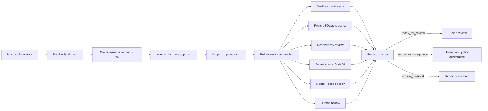

# Architecture

Northstar is two systems in one repository:

1. a stateless Orders API with PostgreSQL as its durability boundary; and
2. an AI engineering system that governs how agents plan, implement, evaluate,
   and hand work to humans.

The design follows the learning guide's control loop:

```text
task contract -> plan -> human plan approval -> act -> evaluate
      ^                                                   |
      +-------------- repair or escalate ----------------+
```

The responsibility boundary is **agents propose; humans and policy accept**.

## System of record and external memory

GitHub is the system of record:

| Artifact | Canonical responsibility |
| --- | --- |
| Issue | Goal, constraints, non-goals, scope, success criteria, validation, rollout |
| Plan-first pull request | Current plan, risk, decisions, handoffs, rollback |
| Branch and commits | Isolated implementation history |
| Checks and workflow runs | Objective evaluation |
| Uploaded artifacts | JUnit, SARIF, dependency, scope, governance, and execution reports |
| Reviews | Plan approval and final human acceptance |
| Environment approval | Critical production authorization |

Chats and model reasoning are short-term memory. They are never authoritative.
On resume, an agent re-reads the issue, pull request, base/head SHAs, checks,
and latest reviews.

## Control-plane components



### Task contract

`.github/ISSUE_TEMPLATE/agent-task.yml` defines inputs, outputs, success
criteria, validation expectations, rollout expectations, and stop conditions.
`scripts/task-contract.mjs` verifies the shape, trusted issue provenance, and a
SHA-256 body digest. Offline fixtures are accepted only for tests and demos and
are marked untrusted.

### Plan and risk

`scripts/plan-contract.mjs` validates a `northstar/plan/1` document embedded in
the PR plan. It binds the task-contract digest, base SHA, path scope, success
criteria, risk, required checks, evidence, decisions, and rollback.

`.github/governance/policy.json` implements the guide's risk levels:

- `low`: reversible documentation and formatting;
- `medium`: dependencies and bounded application changes;
- `high`: workflows, hooks, agents, security, infrastructure, and migrations;
- `critical`: production deployment or production-secret access.

The declared risk may exceed the deterministic floor but cannot lower it.

### Approval

High and critical work uses a plan-first pull request. A valid plan approval is
a human `APPROVED` review of the plan-only commit plus a durable record binding:

- task and contract digest;
- canonical plan digest;
- plan PR and review IDs;
- base SHA and reviewed commit;
- reviewer and timestamp.

Editing the canonical plan changes its digest and invalidates the record.
Final implementation approval is separate and must target the current head SHA.

### Capabilities and hooks

Custom agents expose only the tools their role needs. The native Copilot hook
uses `PreToolUse` to deny missing-contract writes, out-of-scope paths,
unapproved commands, secret handling, external exfiltration, direct publishing,
and destructive operations.

`PostToolUse`, `PostToolUseFailure`, and `SessionEnd` produce payload-free local
audit records. Those records contain hashes and attribution, not raw prompts,
commands, payloads, or secrets. Copilot command-hook timeouts are fail-open, so
hooks are defense in depth; GitHub Actions is the durable acceptance authority.

### Evaluation and evidence

`.github/workflows/governed-change.yml` fans out independent checks and fans
them into one report. Every producer emits a
`northstar/check-evidence/1` envelope with repository, workflow, job, run,
actor, PR, base SHA, head SHA, status, and artifact digest.

`scripts/build-execution-report.mjs` rejects missing, failed, stale,
cross-commit, or cross-run evidence. Success criteria match stable test names,
not arbitrary substrings.

- `ready_for_review`: all local-reference evidence passed; hosted evidence is
  still pending.
- `ready_for_acceptance`: all hosted checks and human approvals passed.
- `review_required`: required evidence failed, is missing, or is stale.

The trusted default-branch publisher writes the commit status
`trusted-acceptance`. Branch protection requires that stable context, so a PR
comment or a PR-controlled workflow cannot substitute for the final verdict.

When `validation-authority` detects that a PR changes its own control plane,
the first trusted verdict remains failed. A second trusted job is gated by the
protected `system-maintenance` environment. A dispatch-only GitHub App starts
that workflow, while a separate trusted-publisher App publishes
`trusted-acceptance`. Their keys are available only in protected,
default-branch environments; neither App is a human environment reviewer.
After approval, the publisher App's Administration-read permission verifies
current repository controls; the job rebinds the same PR and SHA, imports only
allowlisted evidence, replaces the validation-authority record, and may emit a
successful `trusted-acceptance`.

## Continuous AI

`.github/workflows/daily-repository-status.md` is a GitHub Agentic Workflow.
It runs in strict mode with read-only tools, a bounded AI-credit budget, and a
staged safe output. `gh aw compile` produces the hardened `.lock.yml`.

The Agentic Workflow may analyze and propose. It does not replace deterministic
CI, required checks, ownership review, or human acceptance.

## MCP governance

The reference uses built-in GitHub context and does not commit a fake MCP
endpoint. Repository and organization administrators manage MCP servers in
GitHub settings:

- approved servers are discovered through the GitHub MCP Registry or an
  MCP registry v0.1 endpoint;
- only named tools are enabled;
- credentials use protected `COPILOT_MCP_*` runtime variables;
- adding a server or widening tools is treated as a high-risk dependency and
  policy change.

## Runtime boundary

The Orders API is stateless and may run as multiple instances behind a load
balancer:

- any retry can reach a different process;
- process memory is not shared and is lost on restart;
- PostgreSQL is the shared durability and concurrency boundary;
- the API must remain safe when two instances receive the same request
  concurrently.

Raw idempotency keys and request payloads are sensitive correlation data.
Store only hashes and do not write either value to logs or evidence.

## Hosted control boundary

Repository files can express and test the desired governance configuration,
but only GitHub settings can enforce required checks, required code-owner
reviews, direct-push restrictions, secret scanning, push protection, and
protected-environment reviewers.

This private repository currently returns HTTP 403 for ruleset and branch
protection APIs on its plan. The local reference is therefore fully testable,
but hosted integration remains **not verified** until those settings can be
enabled and real pull-request, workflow, review, and environment events run.
