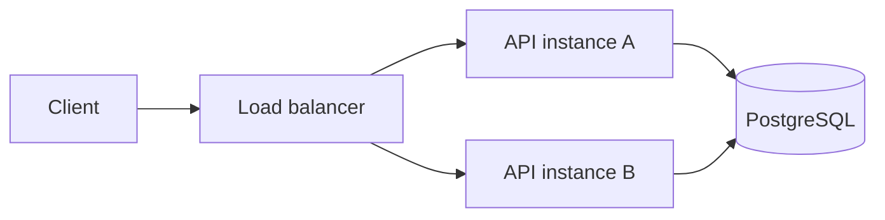

# Runtime architecture

Northstar is a stateless TypeScript/Fastify Orders API. PostgreSQL is the
durability and concurrency boundary for idempotent order creation.



Any retry may reach a different process. Process memory is neither shared nor
durable, so it cannot coordinate idempotency.

## HTTP surface

### `GET /health`

Returns:

```json
{
  "status": "ok"
}
```

### `POST /orders`

Accepts:

```json
{
  "sku": "WIDGET-1",
  "quantity": 2
}
```

`sku` must be a non-empty string and `quantity` must be an integer from 1
through 100.

The optional `Idempotency-Key` header must contain 8 through 128 letters,
numbers, dots, underscores, colons, or hyphens.

| Outcome | Status | Replay header |
| --- | --- | --- |
| New order | `201` | `x-idempotent-replay: false` |
| Same key and request | `200` | `x-idempotent-replay: true` |
| Same key, different request | `409` | not applicable |
| Invalid input or key | `400` | not applicable |
| Unexpected failure | `500` | not applicable |

## Idempotency transaction

For a request with an idempotency key:

1. Validate the order and key.
2. Canonically serialize `{ quantity, sku }` and hash the request.
3. Salt and hash the idempotency key with SHA-256.
4. Begin a PostgreSQL transaction.
5. Acquire a transaction-scoped advisory lock derived from the key hash.
6. Delete an expired record for that key, if present.
7. Read the current idempotency record.
8. Return its stored response when the request hash matches.
9. Return a conflict when the request hash differs.
10. Otherwise insert the order and idempotency record in the same transaction.
11. Commit and release the connection.

The advisory lock removes the check-then-act race across API instances. The
single transaction prevents an order from committing without its completed
replay record.

## Persistence

`orders` contains:

- UUID order ID;
- SKU;
- quantity;
- creation timestamp.

`idempotency_records` contains:

- a fixed-length key hash as the primary key;
- a fixed-length canonical request hash;
- the related order ID;
- the response body needed for replay;
- creation and expiration timestamps.

Records expire after 24 hours. Expired records are removed lazily when the same
key is used again.

Raw idempotency keys and raw request payloads are not persisted. Application
and workflow logs must not contain them.

## Baseline mode

When `DATABASE_URL` is absent, `src/server.ts` uses an in-memory order
repository. This mode demonstrates the basic API but intentionally does not
claim cross-instance idempotency.

When `DATABASE_URL` is present, the server uses
`PostgresIdempotentOrderService`.

## Telemetry

The reference metrics interface records replay and conflict counts without
recording keys or payloads. The current in-memory metrics implementation is
used by acceptance tests and can be replaced by a production metrics adapter.

## Failure behavior

- Validation errors return a controlled `400`.
- Reusing a key for a different request returns a controlled `409`.
- Database or unexpected failures roll back and return a generic `500`.
- If both the transaction and rollback fail, the service surfaces both errors
  as an `AggregateError`.
- The implementation does not retry database operations indefinitely.

## Evidence

Unit tests cover domain, service, policy, and evidence behavior without
external dependencies.

PostgreSQL acceptance tests create two service instances over one database and
prove:

- same-instance replay;
- cross-instance replay;
- conflicting payload rejection;
- exactly one order under concurrent cross-instance retries;
- baseline behavior without a key;
- replay and conflict metrics;
- HTTP behavior across two Fastify instances;
- fixed-length hashes instead of raw sensitive values.

See [`adr/007-durable-idempotency.md`](adr/007-durable-idempotency.md) for the
decision record.

## Repair of the agent control plane

The `AES-SURFACE-EVIDENCE` repair is bound to task
[issue 14](https://github.com/webmaxru/northstar-orders-api-demo/issues/14) and
the approved bootstrap [plan PR 15](https://github.com/webmaxru/northstar-orders-api-demo/pull/15).
These are fictional reference-system tasks, not production incidents.

The guide's plan-first option requires a PR containing only the plan, not a
zero-file diff. New publication therefore commits the task's regular Markdown
artifact at `docs/plans/<task-id>.md`, using an isolated Git index. It does not
stage or publish the caller's unrelated working-tree edits. Only the explicitly
authorized publisher writes this artifact; the planner remains read-only.
Configured eligible human reviewers are requested when the PR is published.
Native review approval is derived from the committed artifact and its current
task/base/head identities. A mutated PR-description mirror is rejected.
The old zero-file approval record is accepted only for the pinned bootstrap.

SessionStart accepts documented initial prompt fields and the cloud prompt
environment variable in addition to an explicit issue variable. Prompt-hook
failure clears cached authority. All edit paths, including supported absolute
paths and patch moves, are checked against the repository, task and plan.
Unknown payloads cannot widen scope. The cloud path requires a real matching
PR and immutable plan/task/base/head identity, not just a `copilot/` prefix.
One repository-level Stop dispatcher selects the explicit plan or implement
role, preserving the host's session identity and stop-loop flag.

Evidence must bind real artifacts and complete producer identity. Missing,
modified, stale or mismatched task/plan/base/head/run/attempt evidence fails.
Dirty local source cannot be represented solely by HEAD. Stop validates the
current plan and evidence-command result rather than reusing an older passing
report; bounded recovery escalates instead of reporting a successful fallback.
Scanner invocation, parsing and input-read failures are validation failures.
The compiler wrapper additionally rejects error diagnostics even when the
compiler process exits zero.

The new process acceptance test starts separate Node servers using the real
application, shared PostgreSQL and actual HTTP. It uses a unique test schema,
checks concurrent replay, conflicting payloads and process restart, and cleans
up only that schema and those processes. This complements, rather than relabels,
the earlier in-process acceptance tests.

These source changes do not prove a deployed browser flow, host parity, or
hosted acceptance. A new browser-only plan review and real CLI/VS Code/cloud
canaries remain acceptance requirements after the changed controls are reviewed.
Rules/branch protection, protected environments, App identities and secrets
are external administrator settings, not established by repository files.

### Adoption settings

`CUSTOMIZE` comments mark runtime invocation, reviewer ownership, workflow
model/budget/retention, scanner versions and test-database endpoints.
Governance JSON uses `$comment` rather than invalid JSON comments. The
`optionalCapabilities.mcp` and `optionalCapabilities.continuousAI` switches
default to enabled when omitted; disabling one requires removing its active
integration files too. Remove the Northstar-specific legacy-plan exception
when adopting in another repository. Protocol schemas, approval identity and
evidence requirements are not convenience switches.
The unit commands cap workers at two to avoid saturating a shared development
machine with the Git/process fixture tests. The 30-second test timeout permits
process startup on Windows; individual behavior assertions remain unchanged.
