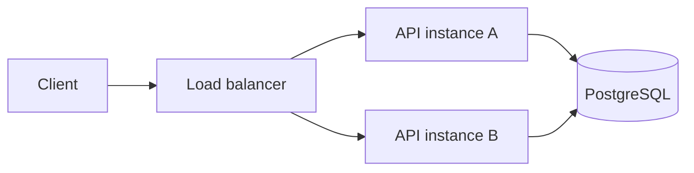

# Runtime architecture

Northstar is a stateless TypeScript/Fastify Orders API. PostgreSQL is the
durability and concurrency boundary for idempotent order creation.



Any retry may reach a different process. Process memory is neither shared nor
durable, so it cannot coordinate idempotency.

## HTTP surface

### `GET /health`

Returns:

```json
{
  "status": "ok"
}
```

### `POST /orders`

Accepts:

```json
{
  "sku": "WIDGET-1",
  "quantity": 2
}
```

`sku` must be a non-empty string and `quantity` must be an integer from 1
through 100.

The optional `Idempotency-Key` header must contain 8 through 128 letters,
numbers, dots, underscores, colons, or hyphens.

| Outcome | Status | Replay header |
| --- | --- | --- |
| New order | `201` | `x-idempotent-replay: false` |
| Same key and request | `200` | `x-idempotent-replay: true` |
| Same key, different request | `409` | not applicable |
| Invalid input or key | `400` | not applicable |
| Unexpected failure | `500` | not applicable |

## Idempotency transaction

For a request with an idempotency key:

1. Validate the order and key.
2. Canonically serialize `{ quantity, sku }` and hash the request.
3. Salt and hash the idempotency key with SHA-256.
4. Begin a PostgreSQL transaction.
5. Acquire a transaction-scoped advisory lock derived from the key hash.
6. Delete an expired record for that key, if present.
7. Read the current idempotency record.
8. Return its stored response when the request hash matches.
9. Return a conflict when the request hash differs.
10. Otherwise insert the order and idempotency record in the same transaction.
11. Commit and release the connection.

The advisory lock removes the check-then-act race across API instances. The
single transaction prevents an order from committing without its completed
replay record.

## Persistence

`orders` contains:

- UUID order ID;
- SKU;
- quantity;
- creation timestamp.

`idempotency_records` contains:

- a fixed-length key hash as the primary key;
- a fixed-length canonical request hash;
- the related order ID;
- the response body needed for replay;
- creation and expiration timestamps.

Records expire after 24 hours. Expired records are removed lazily when the same
key is used again.

Raw idempotency keys and raw request payloads are not persisted. Application
and workflow logs must not contain them.

## Baseline mode

When `DATABASE_URL` is absent, `src/server.ts` uses an in-memory order
repository. This mode demonstrates the basic API but intentionally does not
claim cross-instance idempotency.

When `DATABASE_URL` is present, the server uses
`PostgresIdempotentOrderService`.

## Telemetry

The reference metrics interface records replay and conflict counts without
recording keys or payloads. The current in-memory metrics implementation is
used by acceptance tests and can be replaced by a production metrics adapter.

## Failure behavior

- Validation errors return a controlled `400`.
- Reusing a key for a different request returns a controlled `409`.
- Database or unexpected failures roll back and return a generic `500`.
- If both the transaction and rollback fail, the service surfaces both errors
  as an `AggregateError`.
- The implementation does not retry database operations indefinitely.

## Evidence

Unit tests cover domain, service, policy, and evidence behavior without
external dependencies.

PostgreSQL acceptance tests create two service instances over one database and
prove:

- same-instance replay;
- cross-instance replay;
- conflicting payload rejection;
- exactly one order under concurrent cross-instance retries;
- baseline behavior without a key;
- replay and conflict metrics;
- HTTP behavior across two Fastify instances;
- fixed-length hashes instead of raw sensitive values.

See [`adr/007-durable-idempotency.md`](adr/007-durable-idempotency.md) for the
decision record.
