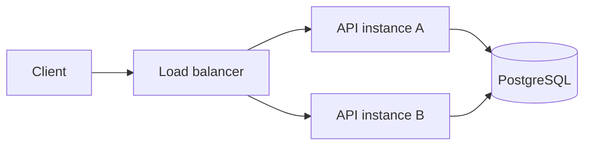

# Runtime architecture

Northstar is a stateless TypeScript/Fastify Orders API. PostgreSQL is the
durability and concurrency boundary for idempotent order creation.


```mermaid
flowchart LR
  C[Client] --> L[Load balancer]
  L --> A[API instance A]
  L --> B[API instance B]
  A --> P[(PostgreSQL)]
  B --> P
```

Any retry may reach a different process. Process memory is neither shared nor
durable, so it cannot coordinate idempotency.

## HTTP surface

### `GET /health`

Returns:

```json
{
  "status": "ok"
}
```

### `POST /orders`

Accepts:

```json
{
  "sku": "WIDGET-1",
  "quantity": 2
}
```

`sku` must be a non-empty string and `quantity` must be an integer from 1
through 100.

The optional `Idempotency-Key` header must contain 8 through 128 letters,
numbers, dots, underscores, colons, or hyphens.

| Outcome | Status | Replay header |
| --- | --- | --- |
| New order | `201` | `x-idempotent-replay: false` |
| Same key and request | `200` | `x-idempotent-replay: true` |
| Same key, different request | `409` | not applicable |
| Invalid input or key | `400` | not applicable |
| Unexpected failure | `500` | not applicable |

## Idempotency transaction

For a request with an idempotency key:

1. Validate the order and key.
2. Canonically serialize `{ quantity, sku }` and hash the request.
3. Salt and hash the idempotency key with SHA-256.
4. Begin a PostgreSQL transaction.
5. Acquire a transaction-scoped advisory lock derived from the key hash.
6. Delete an expired record for that key, if present.
7. Read the current idempotency record.
8. Return its stored response when the request hash matches.
9. Return a conflict when the request hash differs.
10. Otherwise insert the order and idempotency record in the same transaction.
11. Commit and release the connection.

The advisory lock removes the check-then-act race across API instances. The
single transaction prevents an order from committing without its completed
replay record.

## Persistence

`orders` contains:

- UUID order ID;
- SKU;
- quantity;
- creation timestamp.

`idempotency_records` contains:

- a fixed-length key hash as the primary key;
- a fixed-length canonical request hash;
- the related order ID;
- the response body needed for replay;
- creation and expiration timestamps.

Records expire after 24 hours. Expired records are removed lazily when the same
key is used again.

Raw idempotency keys and raw request payloads are not persisted. Application
and workflow logs must not contain them.

## Baseline mode

When `DATABASE_URL` is absent, `src/server.ts` uses an in-memory order
repository. This mode demonstrates the basic API but intentionally does not
claim cross-instance idempotency.

When `DATABASE_URL` is present, the server uses
`PostgresIdempotentOrderService`.

## Telemetry

The reference metrics interface records replay and conflict counts without
recording keys or payloads. The current in-memory metrics implementation is
used by acceptance tests and can be replaced by a production metrics adapter.

## Failure behavior

- Validation errors return a controlled `400`.
- Reusing a key for a different request returns a controlled `409`.
- Database or unexpected failures roll back and return a generic `500`.
- If both the transaction and rollback fail, the service surfaces both errors
  as an `AggregateError`.
- The implementation does not retry database operations indefinitely.

## Evidence

Unit tests cover domain, service, policy, and evidence behavior without
external dependencies.

PostgreSQL acceptance tests create two service instances over one database and
prove:

- same-instance replay;
- cross-instance replay;
- conflicting payload rejection;
- exactly one order under concurrent cross-instance retries;
- baseline behavior without a key;
- replay and conflict metrics;
- HTTP behavior across two Fastify instances;
- fixed-length hashes instead of raw sensitive values.

See [`adr/007-durable-idempotency.md`](adr/007-durable-idempotency.md) for the
decision record.

## Repair of the agent control plane

The `AES-SURFACE-EVIDENCE` repair is bound to task
[issue 14](https://github.com/webmaxru/northstar-orders-api-demo/issues/14) and
the approved bootstrap [plan PR 15](https://github.com/webmaxru/northstar-orders-api-demo/pull/15).
These are fictional reference-system tasks, not production incidents.

The guide's plan-first option requires a PR containing only the plan, not a
zero-file diff. New publication therefore commits the task's regular Markdown
artifact at `docs/plans/<task-id>.md`, using an isolated Git index. It does not
stage or publish the caller's unrelated working-tree edits. Only the explicitly
authorized publisher writes this artifact; the planner remains read-only.
Configured eligible human reviewers are requested when the PR is published.
Native review approval is derived from the committed artifact and its current
task/base/head identities. A mutated PR-description mirror is rejected.
The old zero-file approval record is accepted only for the pinned bootstrap.

SessionStart accepts documented initial prompt fields and the cloud prompt
environment variable in addition to an explicit issue variable. Prompt-hook
failure clears cached authority. All edit paths, including supported absolute
paths and patch moves, are checked against the repository, task and plan.
Unknown payloads cannot widen scope. The cloud path requires a real matching
PR and immutable plan/task/base/head identity, not just a `copilot/` prefix.
One repository-level Stop dispatcher selects the explicit plan or implement
role, preserving the host's session identity and stop-loop flag.

Evidence must bind real artifacts and complete producer identity. Missing,
modified, stale or mismatched task/plan/base/head/run/attempt evidence fails.
The preliminary Governed Change report may consume only its current-run
`plan-contract` and `scope-policy` producer records after validating their
task, plan, source, run, attempt, job and artifact identities. The trusted
Publish Evidence workflow recomputes these controls before publishing
`trusted-acceptance`; producer records alone cannot establish acceptance.
The trusted Publish Evidence workflow uses a separate short-lived App token
limited to read permissions for repository-control metadata; its
write-capable publisher token remains separate. The protected System
Maintenance workflow independently revalidates controls after its environment
approval. Pull-request jobs never receive protected App private keys. If token
creation or a metadata lookup is unavailable, the control remains blocking. A
404 from legacy branch protection is treated as absence only after the trusted
ruleset lookup succeeds and the active ruleset satisfies the policy
alternative.
Dirty local source cannot be represented solely by HEAD. Stop validates the
current plan and evidence-command result rather than reusing an older passing
report; bounded recovery escalates instead of reporting a successful fallback.
Scanner invocation, parsing and input-read failures are validation failures.
The compiler wrapper additionally rejects error diagnostics even when the
compiler process exits zero.

The new process acceptance test starts separate Node servers using the real
application, shared PostgreSQL and actual HTTP. It uses a unique test schema,
checks concurrent replay, conflicting payloads and process restart, and cleans
up only that schema and those processes. This complements, rather than relabels,
the earlier in-process acceptance tests.

These source changes do not prove a deployed browser flow, host parity, or
hosted acceptance. A new browser-only plan review and real CLI/VS Code/cloud
canaries remain acceptance requirements after the changed controls are reviewed.
Rules/branch protection, protected environments, App identities and secrets
are external administrator settings, not established by repository files.

For the AES-SURFACE-EVIDENCE bootstrap, AC15 is deferred to the post-acceptance
stage of controlled bootstrap activation, but must be proven before final Issue
#14 acceptance. Before the browser canary, the report may be
`ready_for_review` only when every non-deferred criterion and applicable check
passes; AC15 remains unverified and `ready_for_acceptance` stays blocked.

The protected system-maintenance workflow permits only that exact staged
state: `ready_for_review`, AC15 as the sole unverified criterion, and
`browser-plan-canary` as the sole missing hosted check. It may record the
environment-approved control-plane activation, but it publishes no
ready-for-acceptance status. The canary is a file-backed plan-only PR on the
separate `plan/<task>-canary` branch, leaving the legacy bootstrap plan
isolated. After an eligible reviewer approves its immutable plan, the trusted
publisher dispatches protected maintenance to revalidate and bind the live task
contract, bootstrap approval, original implementation PR/head, source and
evidence runs, canary PR/head/blob, and native review event. Only a fully
proven report may publish `ready_for_acceptance`. Hosted proof remains pending
until this exact flow completes; repository files do not establish external
ruleset, App-permission, or secret configuration.

The post-merge verifier resolves the original PR only through the explicit
canary dispatch, checks the merge commit against the captured source base and
exact source head, and reports against that original base rather than the
advanced default branch. The legacy bootstrap approval remains valid only for
its pinned plan commit, contract, reviewer, and original base; changing any
pinned identity still fails closed.

The combined-mode controller selects a lower-risk proposed plan from the same
implementation PR, not a separate `plan/<task>` PR. This applies only to
combined low/medium execution; the AC15 high-risk browser canary uses its
separate file-backed `plan/<task>-canary` PR. The controller validates live task,
base/head, repository and ancestry and creates no approval record. Local
`/work` startup may prepare only a bounded proposal artifact, then activate it
through the dedicated materialization command before any source edit.
Resuming local proposals requires an explicit artifact selector and fresh
validation; existing files are not default authority. Hosted workflows select
the candidate or independently approved plan according to risk and retain
security checks and final human acceptance for both modes.

A real CodeQL run exposed valid informational SARIF notifications whose
`message.text` is empty. The parser now accepts that valid message shape while
still failing absent/wrong-typed diagnostics, error-level notifications,
unsuccessful invocations and findings. The downloaded original CodeQL result
was revalidated directly; this is distinct from claiming every hosted gate passed.

The one-time trusted-acceptance bootstrap has a separate protected-default-
branch `workflow_dispatch` route. It accepts only the exact source run and
attempt, parent PR #18, and current independently approved issue #24 plan
revision. Before downloading artifacts, the trusted resolver rechecks the
source workflow/event, repository, task and plan, the original base/head
snapshot, the closed-and-merged PR, source-head ancestry in the merge commit,
and the exact restored ruleset 23998987 status integrations: repository
controls 15368 and trusted acceptance 5075466. A missing context, changed
integration, non-strict rule, or bypass actor stops publication before artifact
download or the online audit. The resolver records a digest of the restored
ruleset snapshot in its evidence. It selects artifact IDs only when they belong to the exact completed
producer jobs and attempt; the importer still enforces its path allowlist and
validates producer provenance. The live post-merge `pull.base.sha` is not used
as a substitute for the source run's immutable base snapshot.

When the default branch has advanced beyond the original task plan base, the
migration resolver re-reads the plan-only PR's immutable artifact and native
review, verifies its task/digest/base and eligible reviewer, and requires that
review to predate the source implementation run. It does not treat the plan
PR's now-advanced live base SHA as a new approval or silently rebase the plan.
After the restored-controls audit, a protected system-maintenance continuation
re-resolves both the source run and its exact publisher attempt, selects the
maintenance bundle by its run/job artifact ID before download, and waits for
that publisher attempt to complete successfully before it can issue a
ready-for-acceptance report for a control-plane change.

The trusted publisher never checks out or executes PR code. A fresh report and
the current PR/source-attempt identities are checked again immediately before
posting `trusted-acceptance`; success is possible only for a complete
`ready_for_acceptance` report. The publisher records the returned status
creator, context, original head, App identity, source run/attempt, and report
digest in `trusted-acceptance-status.json`. This workflow does not alter a
ruleset. The one-time maximum-60-minute removal/restoration remains a human
operation gated by the live preflight and must restore the original
`repository-controls` integration 15368 and `trusted-acceptance` App 5075466.

### Adoption settings

`CUSTOMIZE` comments mark runtime invocation, reviewer ownership, workflow
model/budget/retention, scanner versions and test-database endpoints.
Governance JSON uses `$comment` rather than invalid JSON comments. The
`optionalCapabilities.mcp` and `optionalCapabilities.continuousAI` switches
default to enabled when omitted; disabling one requires removing its active
integration files too. Remove the Northstar-specific legacy-plan exception
when adopting in another repository. Protocol schemas, approval identity and
evidence requirements are not convenience switches.
The unit commands cap workers at two to avoid saturating a shared development
machine with the Git/process fixture tests. The 30-second test timeout permits
process startup on Windows; individual behavior assertions remain unchanged.
